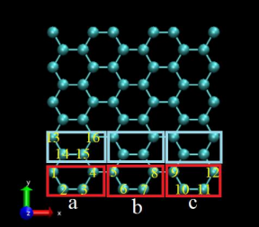

# README
Article title: Determining the structure of functionalized graphene for tailored thermomechanical properties using ML techniques.

Authors: Ravil Ashirmametov, Alexandr Alpatov, Farrokh Yousefi, Narges Vafa, Siamac Fazli and Konstantinos Kostas.

Corresponding author: Ravil Ashirmametov, ravil.ashirmametov@nu.edu.kz

Two datasets are uploaded in the /datasets:

File names are **Results\_for\_H.csv** for hydrogen case, and **Results\_for\_methyl.csv** for methyl case. Datasets are structured as follows:

8528 columns with integer encoding of the layout (1,2,3,4 integer values)

Four columns with extracted thermomechanical properties, in order:

1\. Kappa	

2\. Max Strain

3\. Max Stress

4\. Young's Modulus

For the 8528 columns representing the layout:

1 (both cases) - carbon atom without functionalization;

2 (hydrogen case) - carbon atom and top functionalization with hydrogen atom;

3 (hydrogen case) - carbon atom and bottom functionalization with hydrogen atom;

3 (methyl case) - carbon atom and top functionalization with methyl group;

4 (methyl case) - carbon atom and bottom functionalization with methyl group.

Two attached LAMMPS scripts are in the /LAMMPS Sample Scripts:

**sample\_mechanical** is a LAMMPS script used for MD simulation of the graphene for extraction of three targeted mechanical properties (Young's Modulus, maximum stress, strain at maximum stress);

**sample\_thermal** is a LAMMPS script used for MD simulation of the graphene for extraction thermal conductivity.

To go from the integer encoding in the datasets to a LAMMPS data file, we use following encoding strategy:

To go from LAMMPS data file to the integer encoding in the datasets we use the following encoding strategy:
We consider unit cells consisting of four atoms, as shown in figure with numbers 1,2,3,4. Then, this unit cell is repeated 52 times along x-axis. This is followed by repeating the row 42 times along y-axis. Whenever functional group is encountered we assign value of 2,3 or 4 as described above.

To go back from the integer vector to a data file we firstly map the carbon atoms to unfunctionalized graphene sheet and then attach functional groups, whenever value not equal to one is encountered in the vector.

